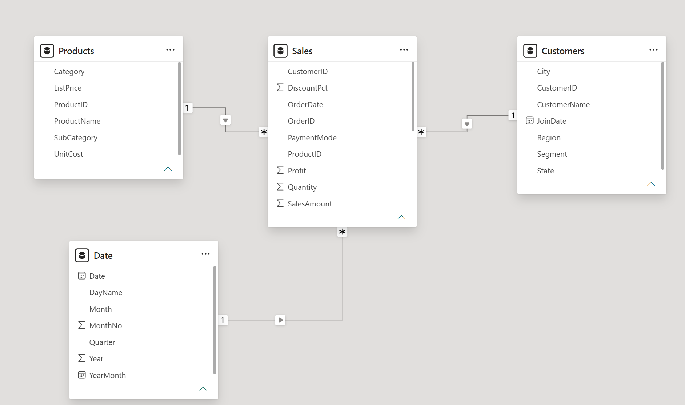

# Retail Sales & Customer Analytics Portfolio

## Project Overview

This project analyzes retail sales and customer data to understand sales performance, customer behavior, product performance, and profitability.

The project uses **Power BI** to transform raw business data into an interactive analytical dashboard. Data cleaning and transformation were performed using **Power Query**, while **DAX** was used to create business measures and KPIs.

The goal of this project is to generate clear, data-driven insights that can help businesses understand customers, identify sales trends, evaluate product performance, and support better decision-making.

## Tools & Technologies

* **Power BI** – Dashboard development and data visualization
* **Power Query** – Data cleaning and transformation
* **DAX** – Business measures and KPI calculations
* **Excel** – Initial data handling and analysis
* **Data Modeling** – Creating relationships between tables

## Project Structure

```text
Retail Sales Customer Analytics Portfolio
│
├── Raw Data
│   └── Retail sales dataset
│
├── Data_Cleaning
│   └── Power_query_steps.md
│
├── Data_Model
│   └── Data_Model.png
│
├── Dax
│   └── Measure.md
│
├── Screenshots
│   └── Dashboard screenshots
│
├── .gitignore
└── README.md
```

## Project Features

* Sales performance analysis
* Revenue and profit analysis
* Customer analysis
* Product performance analysis
* Monthly and yearly sales trends
* Profit margin analysis
* Interactive filters and slicers
* KPI cards for key business metrics
* Interactive Power BI dashboard

## Key KPIs

The dashboard includes the following key business metrics:

* **Total Sales**
* **Total Profit**
* **Profit Margin %**
* **Total Orders**
* **Total Customers**
* **Average Order Value**

## Dashboard Analysis

### Executive Sales Overview

This dashboard provides an executive-level view of overall sales performance, revenue, profit, and key business KPIs.


### Customer Analytics

This dashboard analyzes customer behavior, customer contribution, and purchasing patterns to identify valuable customer segments.


### Product & Profitability Analysis

This dashboard evaluates product and category performance, revenue contribution, and profitability to identify high-performing and underperforming products.


## Business Insights

The analysis helps identify:

* Sales and profit trends over time
* Best-performing product categories
* High-value customers
* Products contributing most to revenue and profit
* Areas with lower sales or profitability
* Overall business performance and potential growth opportunities

## Data Cleaning & Transformation

The raw retail dataset was prepared using **Power Query**.

Key data preparation activities included:

* Data source navigation
* Promoting headers
* Correcting data types
* Cleaning and transforming columns
* Preparing tables for data modeling
* Creating relationships between business entities

## Data Modeling

A structured data model was created in Power BI to connect the relevant tables and support accurate analysis.

The model enables analysis across:

* Sales
* Customers
* Products
* Dates

  

## DAX Measures

DAX was used to create business measures and KPIs, including:

* Total Sales
* Total Profit
* Profit Margin %
* Total Orders
* Total Customers
* Average Order Value

Detailed DAX documentation is available in the **Dax** folder.

## Project Outcome

This project demonstrates practical experience in:

* Data cleaning and transformation
* Data modeling
* DAX calculations
* KPI development
* Interactive dashboard creation
* Business analysis
* Data-driven decision-making

## Data Source

The project uses a retail sales dataset containing information about:

* Sales transactions
* Customers
* Products
* Dates
* Sales amount
* Profit

The dataset was cleaned and transformed using Power Query before being loaded into Power BI for modeling and analysis.

## Author

**Sanket V Shingney**

Data Analyst | Power BI | SQL | Excel | DAX | Power Query

