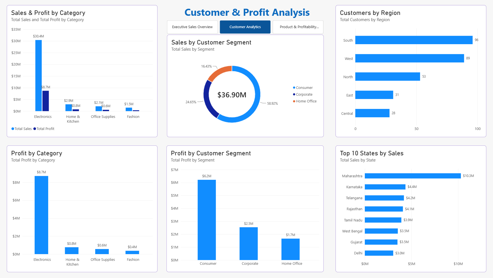

# Retail Sales & Customer Analytics Portfolio

## Project Overview ##

This project analyzes retail sales and customer data to understand sales performance, customer behavior, product performance, and profitability.

The project uses Power BI to transform raw business data into an interactive analytical dashboard. 
Data cleaning and transformation were performed using Power Query, 
while DAX was used to create business measures and KPIs.

The goal of this project is to provide clear, data-driven insights that can help businesses understand their customers, 
identify sales trends, evaluate product performance, and support better decision-making.


## Tools & Technologies ##

- Power BI – Dashboard development and data visualization
- Power Query – Data cleaning and transformation
- DAX – Creating calculated measures and business KPIs
- Excel – Initial data handling and analysis
- Data Modeling – Creating relationships between tables


## Project Structure ##

```text
Retail Sales Customer Analytics Portfolio
│
├── Data Cleaning.md
├── README.md
│
└── DAX
    └── Measures.md


## Project Overview ##

This project analyzes retail sales and customer data using Power BI.

The goal of the project is to understand sales performance, profitability, customer behavior, product performance,
 and overall business trends through an interactive dashboard.

The project includes data cleaning using Power Query, data modeling, DAX measures, 
and interactive Power BI visualizations.


## Project Features ##

- Sales performance analysis
- Revenue and profit analysis
- Customer analysis
- Product performance analysis
- Monthly and yearly sales trends
- Profit margin analysis
- Interactive filters and slicers
- KPI cards for key business metrics
- Interactive Power BI dashboard

## Key KPIs ##

The dashboard includes the following key business metrics:

- Total Sales
- Total Profit
- Profit Margin %
- Total Orders
- Total Customers
- Average Order Value 


## Dashboard Sections ##

### Sales Performance
- Overview of total sales and profit
- Monthly and yearly sales trends
- Sales performance by category and region

### Customer Analysis
- Customer count and purchasing behavior
- Customer contribution to sales
- Analysis of customer segments

### Product Analysis
- Product and category performance
- Top-performing products
- Profitability analysis by product/category

### Business Insights
- Identification of sales and profit trends
- Analysis of high-performing and underperforming areas
- Interactive filtering for detailed analysis


## Business Insights ##

The analysis helps identify:

- Sales and profit trends over time
- Best-performing product categories
- High-value customers
- Products contributing most to revenue and profit
- Areas with lower sales or profitability
- Overall business performance and growth opportunities

## Data Source ##

The project uses a retail sales dataset containing information about:

- Sales transactions
- Customers
- Products
- Dates
- Sales amount and profit

The dataset was prepared and transformed using Power Query 
before being loaded into Power BI for data modeling and analysis.


## Dashboard Preview ## 

### Sales Performance Dashboard


### Customer Analysis Dashboard



### Product Analysis Dashboard


